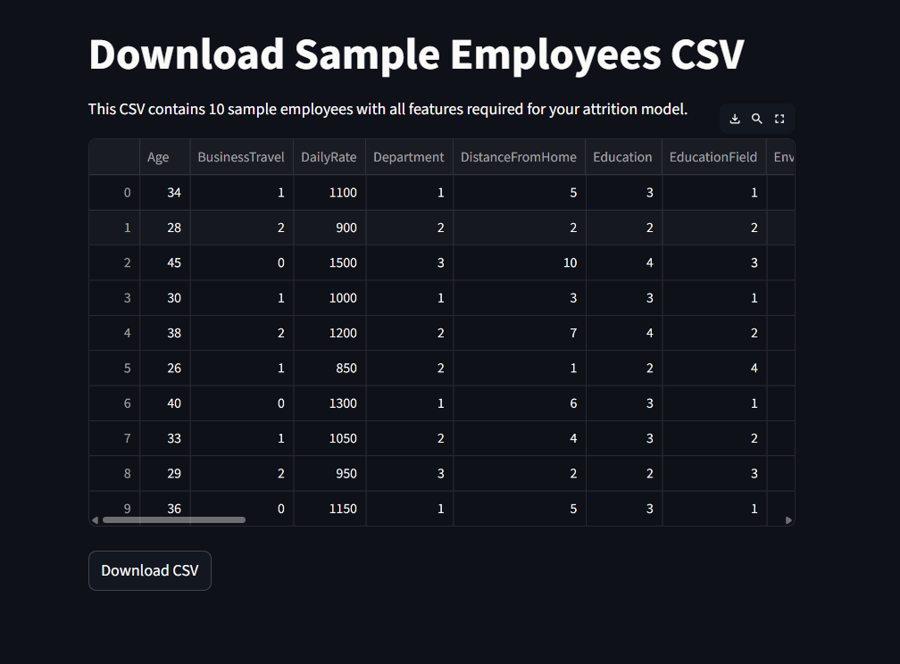

# 🚀 Employee Attrition Prediction Project

This project provides tools to predict employee attrition (whether an employee will **stay** or **leave**) using a trained Random Forest model.  
It includes **two Streamlit applications**:

1. `apps.py` → Generate and download sample employee CSVs.  
2. `app.py` → Predict attrition using batch CSVs or single employee input.

---

## 📋 Features

- **Generate Sample CSV:** Create a CSV file with 10 sample employees with all required features.  
- **Batch Prediction:** Upload a CSV file for multiple employee predictions.  
- **Single Employee Prediction:** Enter employee details manually and get prediction & probability.  
- **Interactive Charts:** Visualize probability of staying or leaving for each employee.  
- **Download Predictions:** Save batch prediction results as CSV.

---

## 🗂️ Project Structure

HR_Attrition_Analysis/
│
├─ apps.py # Streamlit app to generate sample CSV
├─ app.py # Streamlit app for batch & single employee prediction
├─ models/
│ ├─ rf_attrition_model.pkl # Trained Random Forest model
│ └─ scaler.pkl # Scaler used for preprocessing
├─ data/
│ └─ 10 Employ Data for Prediction.csv # Optional sample CSV
├─ notebooks/
│ └─ hr_attrition.ipynb # Jupyter Notebook for EDA & model training
├─ requirements.txt # Python dependencies
└─ README.md


---

## ⚙️ Installation

1. **Clone the repository**

```bash
git clone https://github.com/Nithinneelavara/Employee-Attrition.git
cd Employee-Attrition


2. Create and activate a virtual environment (recommended)

python -m venv venv
# Windows
venv\Scripts\activate
# macOS/Linux
source venv/bin/activate

3. Install dependencies

pip install -r requirements.txt

🚀 Running the Apps

1. Generate Sample CSV (apps.py)
streamlit run apps.py


Opens a Streamlit interface to view and download 10 sample employees CSV.

The CSV has all features in the correct order for the model.

2. Predict Attrition (app.py)
streamlit run app.py


Batch Prediction: Upload a CSV file matching the required columns.

Single Prediction: Fill in employee details manually in the form.

View Charts: Shows probability charts for stay/leave predictions.

Download CSV: Save batch predictions to a CSV file.

🧑‍💼 CSV Column Requirements

All CSV files must have exact columns and order as the model expects:

Age, BusinessTravel, DailyRate, Department, DistanceFromHome,
Education, EducationField, EnvironmentSatisfaction, Gender, HourlyRate,
JobInvolvement, JobLevel, JobRole, JobSatisfaction, MaritalStatus,
MonthlyIncome, MonthlyRate, NumCompaniesWorked, OverTime,
PercentSalaryHike, PerformanceRating, RelationshipSatisfaction,
StockOptionLevel, TotalWorkingYears, TrainingTimesLastYear,
YearsAtCompany, YearsInCurrentRole, YearsSinceLastPromotion,
YearsWithCurrManager, WorkLifeBalance


Categorical values (like BusinessTravel, Gender, OverTime, MaritalStatus) are encoded as integers.

🧩 Notes

Ensure column names match exactly with trained_columns in the prediction model.

Use the CSV generated by apps.py to avoid feature mismatch errors.

Large model files can be managed with Git LFS if needed.

🧰 Dependencies

Python 3.9+

Streamlit

pandas

numpy

scikit-learn

plotly

joblib

Install dependencies via:

pip install -r requirements.txt

📈 Screenshots


Sample CSV Generator (apps.py):



Batch Prediction (app.py):


Single Employee Prediction (app.py):


📜 License

This project is licensed under the MIT License.

🔗 Author

Nithin Neelavara

Email: nithinneelavara@gmail.com

GitHub: https://github.com/Nithinneelavara

